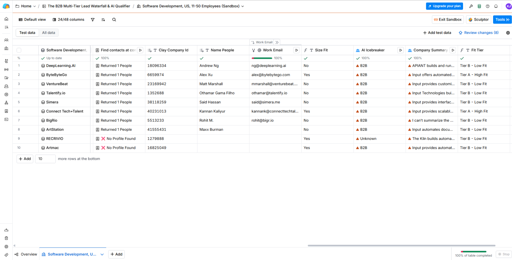

# ⚡ B2B Multi-Tier Lead Waterfall & AI Qualifier (Clay GTM Pipeline)

> **Automated GTM prospect qualification and data enrichment system built to eliminate manual lead research, maximize verified contact hit-rates, and stop wasted enrichment budgets.**

---

## 💡 What’s In It For Your Business (WIIFT)

- **Stop Wasting Enrichment Budget:** Automatically size-gates leads (`11–50 employees`) *before* hitting paid APIs, cutting unnecessary data spend by up to 60%.
- **Protect Email Domain Health:** Runs a multi-tier fallback waterfall for verified work emails, stripping invalid domains to prevent hard bounces and preserve sender reputation.
- **Zero Manual Prospecting:** AI web scrapers parse live company domains, classify ICP fit (Tier A vs. Tier B), and generate customized 1-sentence sales hooks automatically.
- **Production-Ready Pipeline:** Syncs seamlessly via webhooks into n8n, Make.com, or HubSpot for zero-downtime RevOps execution.

---

## 🛠️ How The Engine Works

1. **Deterministic Size Gating (`Size Fit`):** Strictly validates account headcount before invoking third-party data enrichment.
2. **Fallback Email Waterfall (`Work Email`):** Cascades across providers until a high-confidence, verified work email is secured.
3. **AI ICP Qualification (`Fit Tier` & `AI Icebreaker`):** Scrapes live target domains, assigns Tier A (High Fit) or Tier B (Low Fit), and synthesizes personalized opening lines.

---
*Built by Kristian Jay Eñaga | Systems Integration Engineer*
